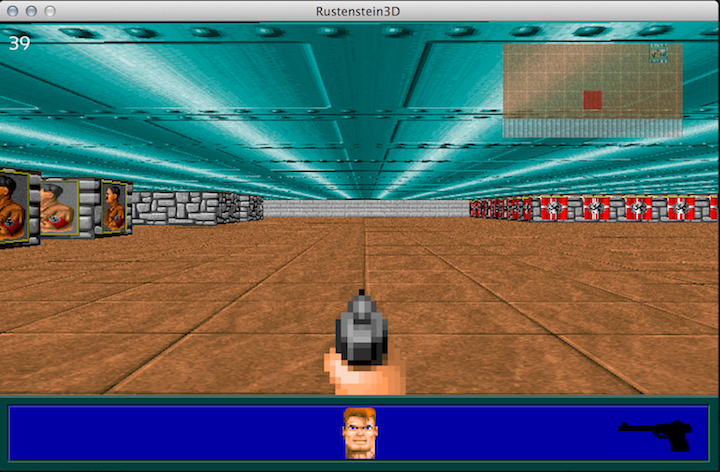

rustenstein3D
=============

Simple Wolfenstein3D engine in rust.

Compilation
===========

First install rust-sfml in the rustenstein3D workspace.

Then use rustpkg to build rustenstein3D.

```Shell
> rustpkg install rustenstein3D
```

Screenshot
==========

